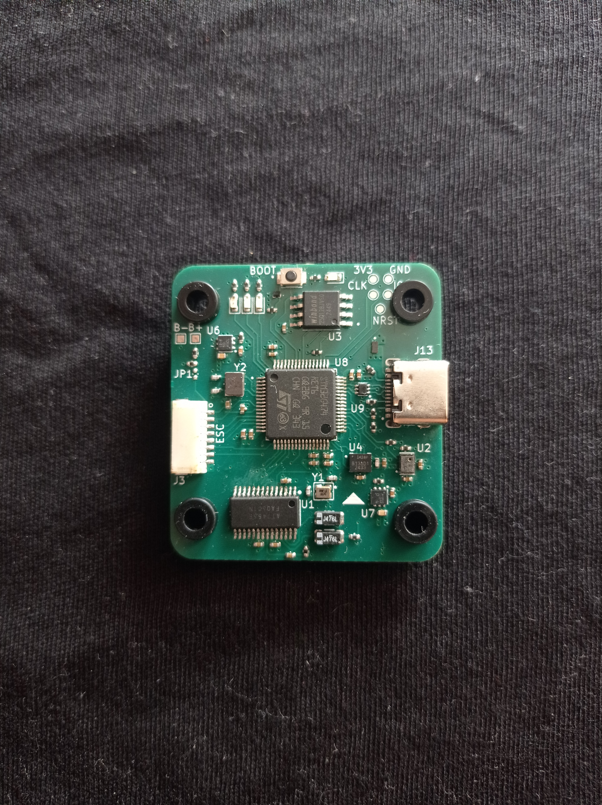
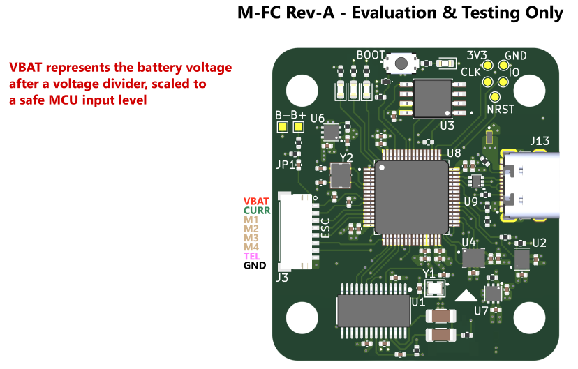
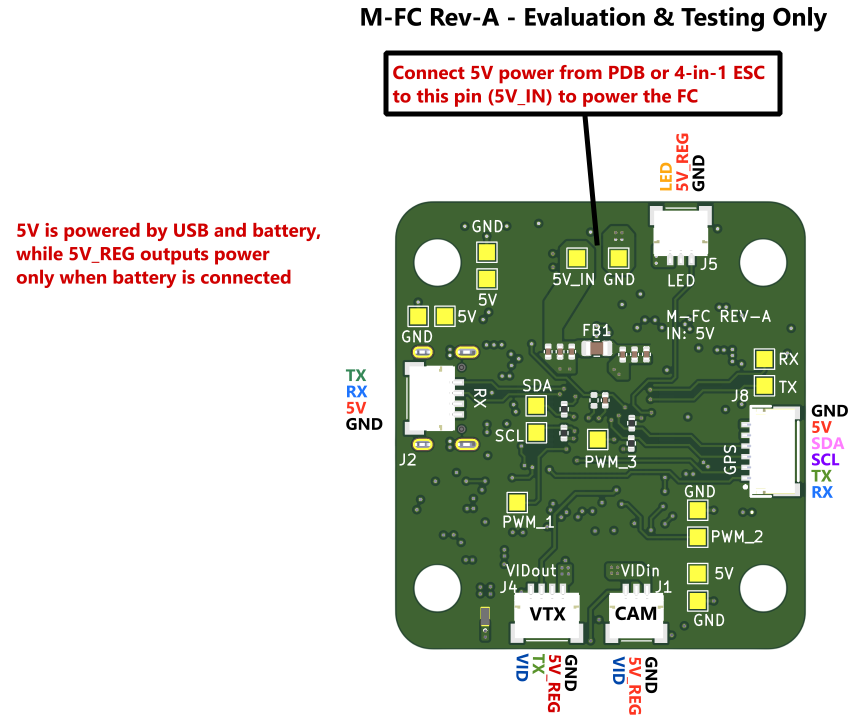

# M-FC — Modular Flight Controller (REV-1)

> **Note:** This is REV-1 — a Proof-of-Concept / educational build. REV-2 is in development and will address known hardware ergonomics issues. Not recommended for production use.

---

## Overview

M-FC is a DIY flight controller designed for FPV drones, built around the STM32G474RET6 microcontroller and running Betaflight 4.6. The "Modular" name reflects the connector philosophy — every peripheral interface is broken out via JST-SH connectors, making wiring clean, repeatable, and swap-friendly.

The board is paired with a dedicated PDB in a standard FC/PDB stack configuration. The FC itself operates at 5V (no onboard BEC), sourcing power from the ESC or PDB. REV-2 will include an onboard BEC.

---

## Hardware Specifications

| Component | Details |
|---|---|
| **MCU** | STM32G474RET6 |
| **IMU** | ICM-42688-P (SPI2) |
| **Barometer** | DPS368 (I2C4) |
| **Magnetometer** | Not populated |
| **OSD** | AT7456E (SPI1) |
| **Blackbox Flash** | W25Q128JVSIQ — 16 MB (SPI3) |
| **USB** | USB-C (with detect on PA10) |
| **Mounting** | 30.5 × 30.5 mm |
| **Input Voltage** | 5V (no onboard BEC — requires 5V from ESC or PDB) |

### Power Architecture

The FC does not regulate voltage from the battery. **5V must be supplied externally** — either from an ESC BEC or from the PDB — via the dedicated 5V pads on the board.

Two separate LDO regulators are present onboard:
- One for the MCU
- One for sensors (IMU, barometer)

A **Schottky diode** is used to isolate USB power from battery power. When powered via USB only, the FC supplies power exclusively to the MCU, sensors (IMU, barometer), OSD chip, flash, GPS, and RX. All remaining peripherals (motors, VTX, etc.) are only powered when the battery is connected via the PDB.

### PDB (Stack)

| Parameter | Value |
|---|---|
| **Max continuous current** | ~120 A total |
| **Per-motor channel** | ~30 A |
| **Configuration** | FC + PDB stack |

The FC connects to the PDB via an 8-pin JST-SH connector plus dedicated `5V_IN` and `GND` solder pads. The `5V_IN` pad powers the FC only — it does not back-feed to the PDB rail.

The PDB includes:
- **5V buck converter** — 2.5 A output
- **9V buck converter** — 2.5 A output (configurable to 12V by replacing resistor R5 — refer to the schematic for the correct resistor value via the linked Texas Instruments buck calculator)

Each ESC must be connected through the PDB. The `VBAT` pin on the 8-pin JST-SH outputs a voltage-divided signal safe for the MCU ADC, used for battery voltage monitoring in Betaflight.

---

## Connector Pinout

All peripheral connections use JST-SH connectors.

| Connector | Pins | Interface | Notes |
|---|---|---|---|
| **ESC** | 8 | DSHOT + telemetry | Motors 1–4 |
| **RX** | 4 | UART | RC receiver |
| **CAM** | 3 | Camera control | Analog camera |
| **VTX** | 4 | UART | Video transmitter |
| **GPS** | 6 | UART + I2C | GPS + compass |
| **LED** | 3 | LED strip | Addressable LEDs |

### Additional Exposed Pads

- **5V input pads** — mandatory external 5V supply
- **PWM 1–3** — additional PWM outputs
- **UART breakout** — spare UART pads
- **I2C breakout** — spare I2C pads

### Photos & Pinout Diagrams

Additional renders, routing views, and PCB previews are available in the [`img/`](img/) folder.

---

## Betaflight Target

- **Betaflight version:** 4.6
- **Target name:** `M-FC`
- **Manufacturer ID:** `Def`
- **MCU family:** `STM32G47X`

Pre-compiled firmware (`.hex`) and the target config file are included in this repository. The hex supports all features listed below.

### Enabled Features

| Feature | Detail |
|---|---|
| Gyroscope / Accelerometer | ICM-42688-P via SPI2 |
| Barometer | DPS368 via I2C4 |
| Blackbox | W25Q128FV via SPI3, default device |
| OSD | MAX7456 (AT7456E) via SPI1 |
| Motors | DSHOT bitbang, pins PA0–PA3 |
| LED strip | PC0 |
| Buzzer | PC3 (inverted) |
| Debug LEDs | PB6, PB7, PB9 |
| VBAT ADC | PC1 |
| Current ADC | PC2 |
| Camera control | PB0 |
| GPS | Enabled |
| Magnetometer | Enabled (I2C2) |
| Position hold | Enabled |
| Altitude hold | Enabled |

### UART Map

| UART | TX | RX | Suggested Use |
|---|---|---|---|
| UART1 | PC4 | PC5 | — |
| UART3 | PB10 | PB11 | — |
| UART4 | PC10 | PC11 | — |
| UART5 | PC12 | PD2 | — |

### I2C Map

| Bus | SCL | SDA | Used for |
|---|---|---|---|
| I2C2 | PA8 | PA9 | Magnetometer |
| I2C3 | PC8 | PC9 | — |
| I2C4 | PC6 | PC7 | Barometer (DPS368) |

### Motor Timer Map

| Index | Pin | Timer | Channel |
|---|---|---|---|
| Motor 1 | PA0 | TIM2 | CH1 |
| Motor 2 | PA1 | TIM2 | CH2 |
| Motor 3 | PA2 | TIM2 | CH3 |
| Motor 4 | PA3 | TIM2 | CH4 |
| CC | PB0 | TIM3 | CH3 |
| LED strip | PC0 | — | CH1 |

---

## Flashing Firmware

### Pre-compiled hex

1. Download the `.hex` file from this repository.
2. Open **Betaflight Configurator 10.10+**.
3. Enter DFU mode — hold the boot button while plugging in USB-C, or send `bl` via CLI.
4. In the **Firmware Flasher** tab, select **Load Firmware [Local]** and pick the `.hex`.
5. Flash. Avoid **Full chip erase** unless necessary.

### Building from source

You can compile your own firmware with custom flags. Copy the target config file into the `configs/` folder of the Betaflight source tree, then build normally.

Building was tested using WSL. Refer to the official Betaflight build guide for setup instructions:
[https://betaflight.com/docs/development/building/Building-in-Ubuntu](https://betaflight.com/docs/development/building/Building-in-Ubuntu)

---

## Known Issues (REV-1)

- **Connector placement ergonomics** — JST-SH connectors are not optimally positioned for clean cable routing in a standard stack build. This is the primary driver for REV-2.
- **Betaflight 4.5 blackbox bug** — Blackbox was unreliable on Betaflight 4.5. Betaflight 4.6 resolves this; use 4.6 or later.
- **No onboard 5V BEC** — Requires external 5V source from ESC or PDB.

---

## Planned Changes (REV-2)

- Revised connector layout for improved cable management
- Onboard 5V BEC
- Additional ergonomic improvements based on REV-1 testing

---

## Acknowledgements

Thanks to [@awocrf](https://github.com/awocrf) for reviewing the schematic for correctness and readability, and for helping with PCB layout aesthetics.

---

## License

This project is released under the **MIT License**. See [LICENSE](LICENSE) for details.

Firmware is based on [Betaflight](https://github.com/betaflight/betaflight), licensed under **GPLv3**.

---

## Contributing

This is currently a personal/educational project. REV-2 is in active development. Issues and suggestions are welcome via GitHub Issues.
